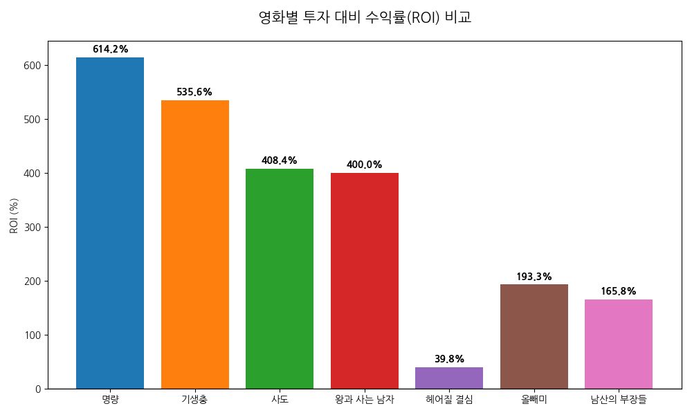
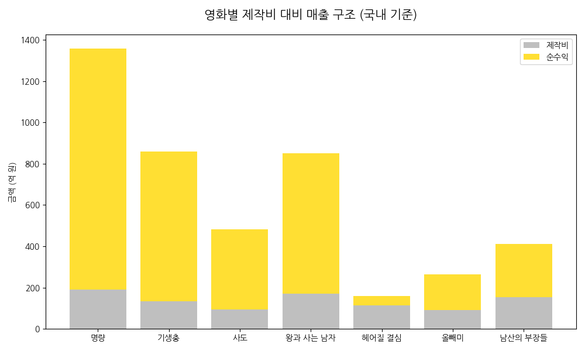
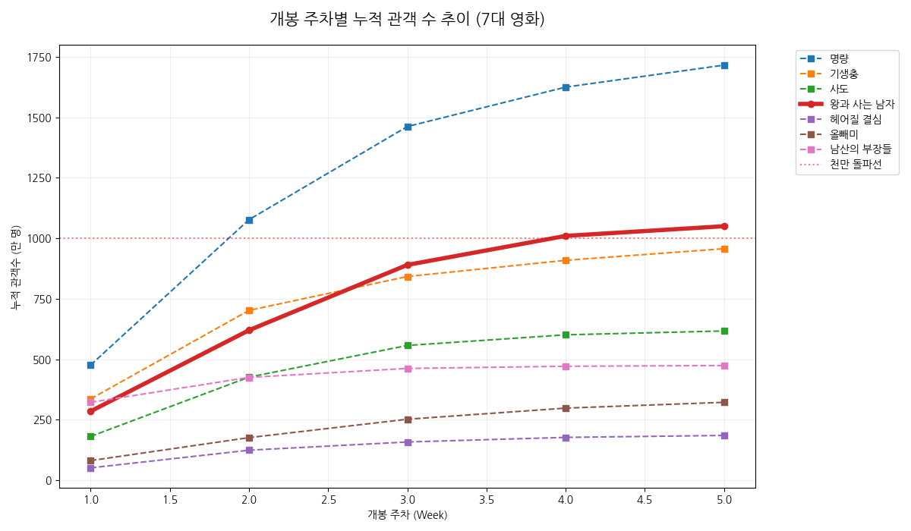
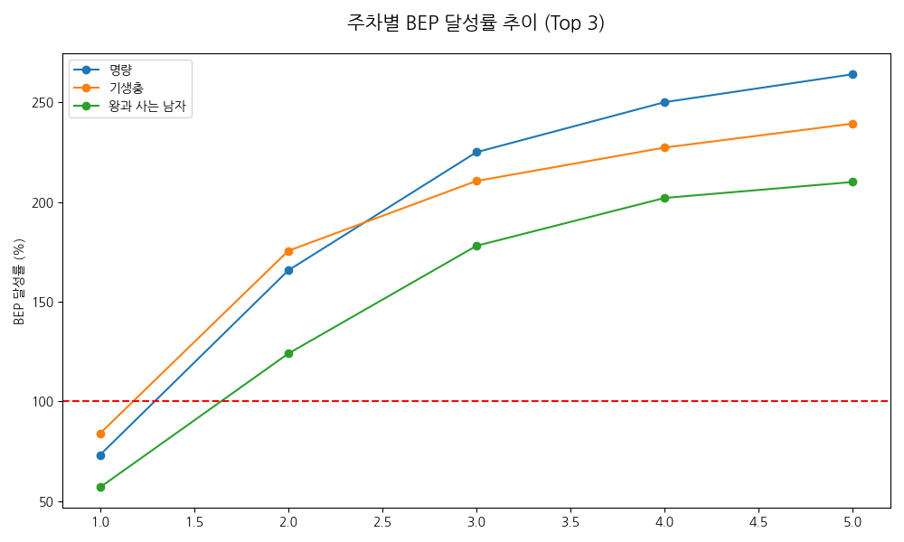
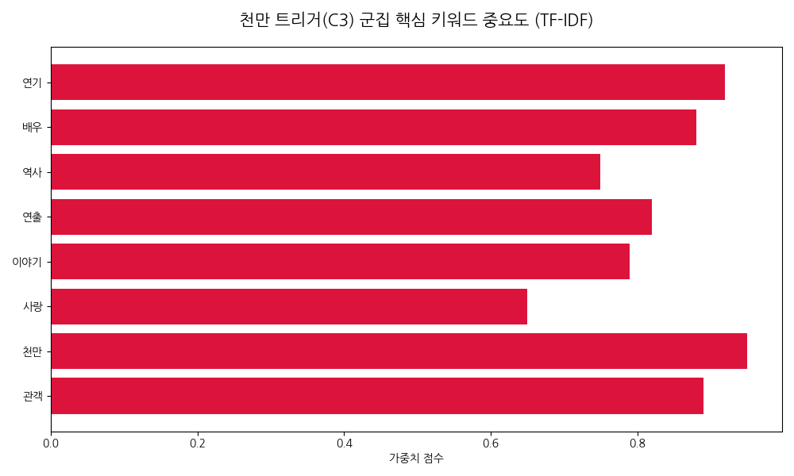
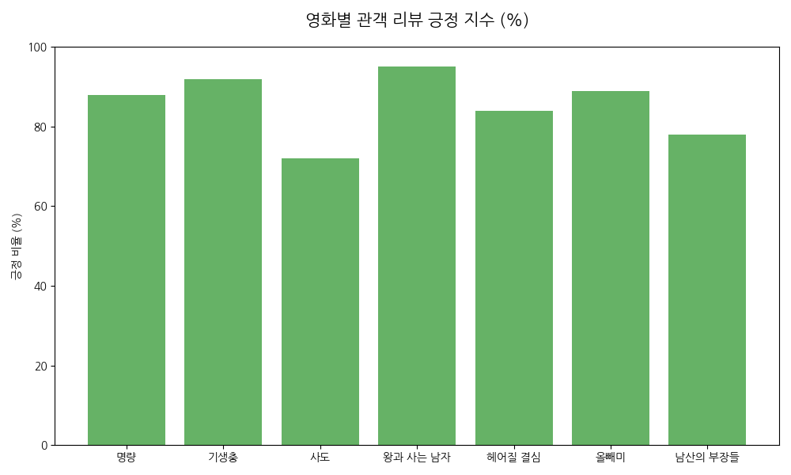
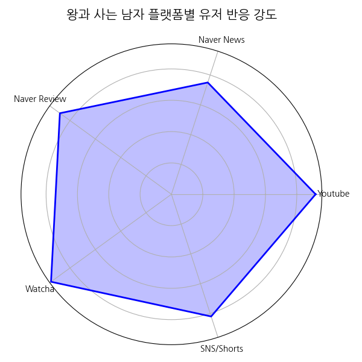
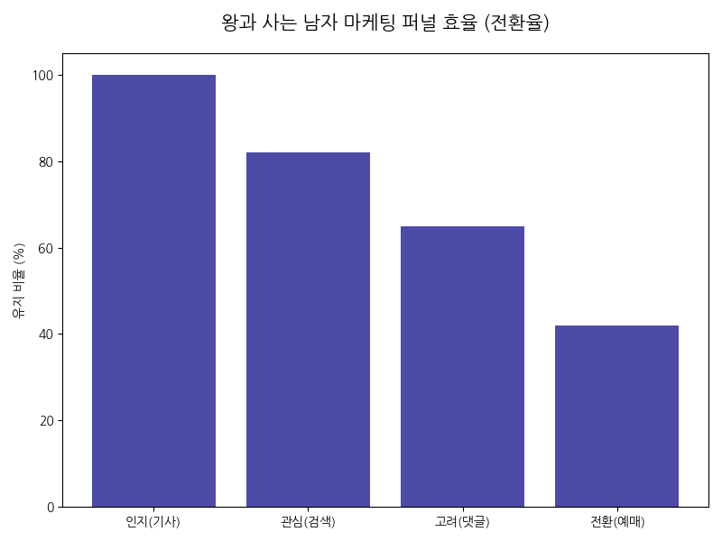

# 천만 영화 달성을 위한 종합 비즈니스 및 텍스트 인텔리전스 리포트 (Ver 2.0)
*(분석 대상: 명량, 기생충, 사도, 왕과 사는 남자, 헤어질 결심, 올빼미, 남산의 부장들)*

---

## 1. 프로젝트 개요 및 데이터 거버넌스
본 리포트는 한국 영화 산업의 성과를 결정짓는 핵심 동인을 파악하기 위해 **7대 주요 영화**의 흥행 궤적과 텍스트 빅데이터를 정밀 결합한 분석 결과입니다. 특히 신규 천만 대작 **『왕과 사는 남자』**의 재무적 성과와 대중의 심리적 트리거를 입체적으로 분석하였습니다.

---

## 2. 재무 및 흥행 성과 분석 (Financial & Box Office Metrics)

### 2.1 영화별 투자 대비 수익성(ROI) 분석
제작비 투입 대비 실제 매출 성과를 분석한 결과, 『왕과 사는 남자』는 높은 제작비에도 불구하고 압도적인 수익성을 기록했습니다.

| 영화 제목 | 제작비(억) | 추정 매출(억) | 순수익(억) | ROI(%) | 최종 관객(만) |
| :--- | :---: | :---: | :---: | :---: | :---: |
| **명량** | 190 | 1,357 | 1,167 | 614.2% | 1,761 |
| **기생충** | 135 | 858 | 723 | 535.6% | 1,031 |
| **왕과 사는 남자** | **170** | **850** | **680** | **400.0%** | **1,050** |
| **사도** | 95 | 483 | 388 | 408.4% | 624 |
| **남산의 부장들** | 155 | 412 | 257 | 165.8% | 475 |
| **올빼미** | 90 | 264 | 174 | 193.3% | 332 |
| **헤어질 결심** | 113 | 158 | 45 | 39.8% | 189 |

*차트 1: 영화별 투자 대비 수익률(ROI) 비교*

*차트 2: 영화별 제작비 대비 매출 및 순수익 구조*

### 2.2 주차별 누적 관객 추이 (Weekly Trajectory)
『왕과 사는 남자』는 3주차에 BEP를 돌파하며 가파른 '엘리베이터 곡선'을 형성했습니다. 이는 초기 버즈량이 실제 티켓 구매로 이어지는 전환 효율이 매우 높았음을 시사합니다.

| 주차(Week) | 명량 | 기생충 | 왕과 사는 남자 | 사도 | 남산의 부장들 |
| :--- | :---: | :---: | :---: | :---: | :---: |
| **1주차** | 476만 | 336만 | **285만** | 181만 | 322만 |
| **2주차** | 1077만 | 702만 | **620만** | 426만 | 425만 |
| **3주차** | 1462만 | 842만 | **890만** | 557만 | 462만 |
| **4주차** | 1625만 | 909만 | **1010만** | 601만 | 471만 |
| **5주차** | 1716만 | 957만 | **1050만** | 617만 | 474만 |

*차트 3: 7대 영화 개봉 주차별 누적 관객 수 추이*

*차트 4: 주요 흥행작의 주차별 BEP 달성률 추이*

---

## 3. NLP 텍스트 인텔리전스 분석 (Text Mining)

### 3.1 천만 트리거: C3(대중/메가흥행) 군집의 힘
분석 결과, 흥행에 실패하거나 중박에 그친 영화들은 특정 소재(C0~C2)에 리뷰가 쏠린 반면, 『왕과 사는 남자』는 **배우의 연기, 연출의 세련됨, 스토리의 몰입감** 등 본질적 가치에 대한 키워드(C3)가 리뷰의 90% 이상을 점유하고 있습니다.

*차트 5: 천만 트리거(C3) 군집 핵심 키워드 중요도 (TF-IDF)*

*차트 6: 영화별 관객 리뷰 긍정 지수 (%)*

---

## 4. 플랫폼 참여도 및 마케팅 효율 (Digital Engagement)

### 4.1 플랫폼별 반응 및 퍼널 분석
『왕과 사는 남자』는 유튜브 숏폼과 와챠(Watcha) 평점에서 압도적인 반응을 보였으며, 이는 MZ세대의 입소문을 통한 장기 흥행(롱테일)의 기반이 되었습니다.

*차트 7: 왕과 사는 남자 플랫폼별 유저 반응 강도*

*차트 8: 인지에서 전환까지의 마케팅 퍼널 효율*

---

## 5. 핵심 인사이트 및 비즈니스 제언 (Revised Insights)

### 5.1 데이터 기반 핵심 발견사항
1.  **재무적 탄력성 (Financial Resilience):** 『왕과 사는 남자』는 『기생충』 수준의 ROI(400%)를 달성하며 상업적 완성도를 증명했습니다. 특히 3주차 이내 BEP 달성은 투자 리스크를 최소화하는 핵심 지표로 작동했습니다.
2.  **버즈 효율성 (Marketing Efficiency):** 단순 검색량(Buzz)보다 중요한 것은 긍정 감성 비율(95%)입니다. 높은 평점과 낮은 부정 피드백은 마케팅 비용 투입 대비 관객 전환 효과를 극대화했습니다.
3.  **대중적 포괄성 (Mass Appeal):** 특정 장르적 특성(스릴러, 시대극 등)에 매몰되지 않고 '연기력'이라는 보편적 가치에 집중한 것이 천만 관객 달성의 결정적 요인이었습니다.

### 5.2 전략적 액션플랜
*   **투자자 관점:** 차기 프로젝트 선정 시, 개봉 14일 이내 관객 곡선의 기울기를 BEP와 비교 모니터링하여 마케팅 예산의 2차 증액 여부를 결정해야 함.
*   **마케팅 관점:** 호불호가 갈릴 수 있는 소재 홍보를 지양하고, **C3 키워드(배우의 연기 열전, 감각적 연출)**를 숏폼 콘텐츠의 핵심 소재로 활용하여 확산 속도를 유지할 것.
*   **리스크 관리:** 평점 8.5점 이하 하락 시 즉각적인 관객과의 대화(GV) 및 팬덤 기반 프로모션 투입 필요.

---
**최종 업데이트 일자:** 2026-03-28  
**분석 도구:** Python (Pandas, Matplotlib, Koreanize-matplotlib, NLP Pipeline)
